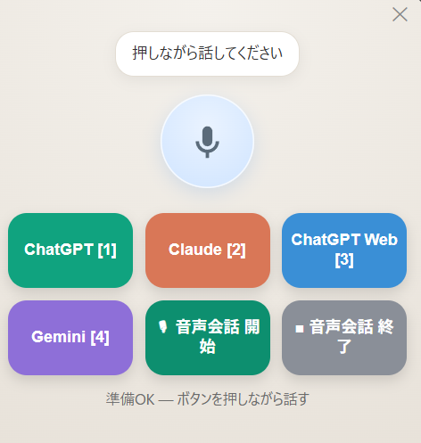
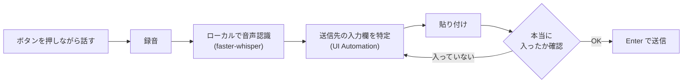

# Voice Router

**ボタンを押しながら話し、離すだけ。選んだAIに、そのまま声で送信できます。**

<p align="center">
  
</p>

対応OS: **Windows 10 / 11**

---

## こんな悩みはありませんか

ChatGPT・Claude・Gemini を併用していると、声で入力するたびにこうなります。

```
ChatGPTに聞きたい → アプリを開く → マイクを押す → 話す → 停止を押す → 送信を押す
Claudeにも聞きたい → 別アプリに切り替える → マイクを押す → 話す → 停止 → 送信
Geminiにも……   → ブラウザのタブを探す → クリック → マイク → 話す → 停止 → 送信
```

アプリごとにマイクの位置も送信ボタンも違い、切り替えのたびに手が止まります。

**Voice Router を使うと、こうなります。**

```
ボタンを押しながら話して、離す。以上。
```

送信先アプリを自分で開く必要も、切り替える必要も、送信ボタンを押す必要もありません。ブラウザのタブも自動で切り替わります。

---

## 使い方

<table>
<tr><td width="60" align="center"><b>1</b></td><td>送りたいAIのボタンを <b>押しながら</b>、話す<br><sub>（テンキーの 1〜4 でも同じ操作ができます）</sub></td></tr>
<tr><td align="center"><b>2</b></td><td><b>指を離す</b></td></tr>
<tr><td align="center"><b>3</b></td><td>そのAIの入力欄に文字が入り、<b>自動で送信されます</b></td></tr>
</table>

テンキーを使えば、Voice Router の画面が他のウィンドウに隠れていても操作できます。

```
テンキー 1 → ChatGPT        テンキー 4 → Gemini
テンキー 2 → Claude         テンキー 5 → 音声会話 開始
テンキー 3 → ChatGPT (Web)  テンキー 6 → 音声会話 終了
```

ボタンの並び順とテンキーの数字が一致します。送信先を増やすと **テンキー 9 まで**自動で割り当てられます。

> **NumLock はオン・オフどちらでも動きます。**
> NumLock オフのときテンキーは矢印キーや Home / PageDown と同じ信号になりますが、テンキー由来かを判別しているため、**本物の矢印キーや Home / PageUp などは奪いません**。

### ライブ音声会話の起動

`🎙 音声会話 開始` を押すと、**ChatGPT のライブ音声会話モード**（声で対話するモード）がワンクリックで始まります。`■ 音声会話 終了` で終了します。

作業中でもタブが自動で切り替わるので、ChatGPTの画面を探す必要はありません。

> ライブ音声会話に対応しているのは、現時点では **ChatGPT（ブラウザ版）のみ**です。
> Claude と Gemini の音声機能は文字起こし（話した内容を入力欄に入れる）だけで、Windows では音声会話モードが提供されていません。そちらは Voice Router の通常のボタンで代替できます。

---

## こんな人向けです

| | |
|---|---|
| **複数のAIを使い分けている人** | 同じ質問を別のAIにも投げて答えを比べたい、用途ごとにAIを変えている |
| **タイピングより話す方が速い人** | 長文の指示や相談を、声でまとめて伝えたい |
| **手が離せないことが多い人** | 作業しながら、資料を見ながらAIに指示したい |
| **プライバシーが気になる人** | 音声認識をローカルで完結させたい（クラウドに音声を送りたくない） |

逆に、**AIを1つしか使っていない人**には、あまりメリットがありません。そのアプリの音声入力で足ります。

---

## しくみ



ポイントは **「入力されたことを確認してから Enter を押す」** ことです。単にキー操作を送るだけだと、アプリが処理中のときに取りこぼして「送ったのに届かない」が起こります。Voice Router は入力欄の中身を読み返して確認します。

ブラウザのタブは、**タブ名ではなく URL で特定**します。ChatGPT などはタブ名が会話のタイトルに変わってしまうため、名前で探すと見失うからです。

---

## インストール

### 1. Python を用意する

[python.org](https://www.python.org/downloads/) から Python 3.10 以降をインストールします。
インストーラの **「Add Python to PATH」に必ずチェック**を入れてください。

### 2. 必要なライブラリを入れる

```bash
pip install -r requirements.txt
```

### 3. 起動する

`VoiceRouter.bat` をダブルクリックします。

初回起動時のみ音声認識モデル（約460MB）が自動でダウンロードされます。「準備OK」と表示されたら使えます。

> 送信したいAIのアプリ（またはブラウザのタブ）は、あらかじめ開いてログインしておいてください。

---

## 送信先を追加・変更する

初回起動時に `voice_router_config.json` が作られます。これを編集して再起動すると、ボタンが増減します。

```json
{
  "targets": [
    { "key": "claude", "label": "Claude", "color": "#d97757",
      "kind": "proc", "proc": "claude.exe" },

    { "key": "gemini", "label": "Gemini", "color": "#8e6fd8",
      "kind": "browser_tab", "browser": "edge",
      "tab": "gemini", "url": "gemini.google.com" }
  ]
}
```

- `kind: "proc"` … デスクトップアプリ。`proc` にプロセス名（タスクマネージャーの「詳細」タブで確認できます）
- `kind: "browser_tab"` … ブラウザのタブ。`tab` はタブ名の一部、`url` はURLの一部
- `kind: "click"` … 録音せず、アプリ内のボタンを押すだけ。`button` に押したいボタン名を並べます（音声会話の起動など）
- `"stt": "app"` … 書き起こしを**送信先アプリ自身に任せる**（ローカル認識を使わないので待ち時間がほぼ無い）

```json
{ "key": "chatgpt_fast", "label": "ChatGPT 高速", "color": "#0b6e58",
  "kind": "browser_tab", "browser": "edge", "tab": "chatgpt", "url": "chatgpt.com",
  "stt": "app",
  "stt_start":  ["音声入力を開始"],
  "stt_submit": ["音声入力を送信"],
  "stt_cancel": ["音声入力をキャンセル"] }
```

> `stt: "app"` は音声がそのAIサービスへ送られます（ローカル完結ではありません）。
> ただし送り先は結局そのAI自身なので、実質的な情報の行き先は変わりません。

```json
{ "key": "gpt_voice", "label": "🎙 音声会話 開始", "color": "#0d8f6f",
  "kind": "click", "browser": "edge", "tab": "chatgpt", "url": "chatgpt.com",
  "button": ["音声を開始する", "Start voice mode"] }
```

> タブ名は会話のタイトルに変わってしまうため、`url` を指定しておくと確実に見つけられます。

`browser` に指定できる値: `edge` / `chrome` / `brave` / `vivaldi` / `any`

### その他の設定

| 項目 | 説明 |
|------|------|
| `engine` | `"vosk"`（既定・**離した瞬間に送信**） / `"whisper"`（精度は少し上だが数秒待つ） |
| `model_size` | whisper使用時のみ。`base`（最速・日本語の精度は落ちる） / `small`（推奨） / `medium`（高精度・かなり重い） |
| `language` | `"ja"`＝日本語固定（既定・最速） / `"en"`＝英語固定 / `null`＝自動判定（遅くなります） |
| `cpu_threads` | 音声認識に使うCPUスレッド数（既定 6）。**全コアを指定するとかえって遅くなります** |
| `hotkeys_enabled` | テンキーのショートカットを使うか |
| `hotkey_swallow` | `true` の間は割り当て済みのテンキーで数字が打てなくなります。数字入力も使いたい場合は `false` |

---

## うまく動かないとき

| 症状 | 対処 |
|------|------|
| 「モデル読込中…」から進まない | 初回はモデルのダウンロードに数分かかります。`voice_router.log` にエラーが出ていないか確認してください |
| 「ウィンドウが見つかりません」 | 送信先アプリが起動しているか確認してください |
| 「ページ内に入力欄が見つかりません」 | 対象サイトのタブを開き、ログイン済みか確認してください |
| 認識精度が低い | `model_size` を `medium` にしてください |
| 送信までが遅い | `engine` が `"vosk"` になっているか確認してください。`"whisper"` は正確ですが数秒かかります |
| 認識に句読点が付かない | Vosk の仕様です。句読点が必要なら `engine` を `"whisper"` にしてください |
| テンキーが効かない | 他のアプリが同じキーを使っている可能性があります。`hotkeys_enabled` を `false` にして画面のボタンで試してください |

---

## 制限事項

- **Windows 専用**です（Windows の UI Automation を使用しているため、macOS / Linux では動きません）
- **Webアプリ化はできません**。ブラウザは他のアプリを操作できないため、この機能はデスクトップアプリでのみ実現できます
- 対応ブラウザは Chromium 系（Edge / Chrome / Brave / Vivaldi）です。Firefox は未対応です
- 音声認識はすべて CPU 上のローカル処理です。既定の Vosk は**話している最中に認識を進める**ため、ボタンを離してから送信されるまで **1秒以内**です
- `engine: "whisper"` に切り替えると精度は少し上がりますが、Whisper は話し終わってから全体をまとめて処理する設計のため、**離してから数秒待つ**ことになります（GPUがない場合）

---

## プライバシー

音声認識はすべてローカルで完結します。音声データも認識結果も外部サーバーへは送信されません（あなたが選んだAIアプリへ入力される内容を除きます）。

---

## ライセンス

MIT
